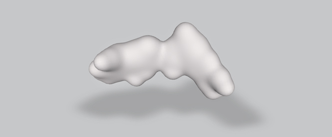

# Advanced Creative Coding

* Prof. Golan Levin • CMU 60-412/712 • Spring 2026
* Monday/Wednesdays 2:00-4:50pm, CFA-303
* [Syllabus](syllabus/readme.md)

---

## Itinerary

* `M Jan 12` [Notes](daily/20260112.md)
* `W Jan 14` [Notes](daily/20260114.md)
* `M Jan 19` *MLK Day; no session*
* `W Jan 21` 
* `M Jan 26` **E1**: Alex, Aren, Christy, Dario, Ian, Leslie, Lorie, Nestor, Suanna
* `W Jan 28` **E1**: Carina, Claire, Jeffrey, Merlin, Vincent, Willie, Xiao, Zhuoyang
* `--------`
* `M Feb 02` Pod discussions
* `W Feb 04` 
* `M Feb 09` 
* `W Feb 11` 
* `M Feb 16`
* `W Feb 18` 
* `M Feb 23` **E2**: Alex, Aren, Dario, Ian, Leslie, Lorie, Nestor, Suanna, Xiao
* `W Feb 25` **E2**: Carina, Christy, Claire, Jeffrey, Merlin, Vincent, Willie, Zhuoyang
* `--------` 
* `M Mar 02` *Spring Break (no session)*
* `W Mar 04` *Spring Break (no session)*
* `M Mar 09` Pod discussions
* `W Mar 11` 
* `M Mar 16`
* `W Mar 18`
* `M Mar 23` **E3**: Alex, Carina, Christy, Claire, Dario, Leslie, Lorie, Merlin, Suanna, Xiao
* `W Mar 25` **E3**: Aren, Ian, Jeffrey, Nestor, Vincent, Willie, Zhuoyang
* `--------`
* `M Mar 30` Pod discussions
* `W Apr 01` 
* `M Apr 06`
* `W Apr 08`
* `M Apr 13`
* `W Apr 15`
* `M Apr 20` **E4**: Alex, Aren, Christy, Claire, Dario, Ian, Leslie, Merlin, Suanna
* `W Apr 22` **E4**: Carina, Jeffrey, Lorie, Nestor, Vincent, Willie, Xiao, Zhuoyang
* `TBA.....` Show

---
