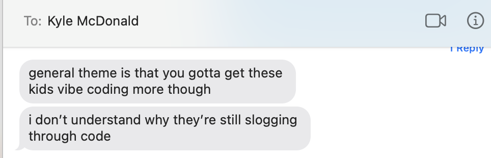

# Wednesday March 11, 2026

* [B*A Friday 3/13, 5:30pm at the STUDIO](https://studioforcreativeinquiry.org/events/ba-2026)
* [realtime depth estimation shading fun](https://www.instagram.com/p/DUDxPUvDq8N)
* [DLG mirror](https://www.instagram.com/polyhop/p/DTeMcjpDG0k/)
* [schultzschultzgrafik](https://www.instagram.com/p/DU6SgDTEaK8)
* [TD face OSC](https://www.instagram.com/p/DVEZzEwjCvl)
* [Julip hand-tracking instruments](https://www.instagram.com/p/DSoKeDGjMHU/)
* [TD hand tracking fun](https://www.instagram.com/p/DVn2ryfkSOj) & [more](https://www.instagram.com/mezerg/reel/DTYN4uwCtuG/), [more](https://www.instagram.com/c.luez/reel/DUoBpw5jCyv/)
* [A thousand layers of stomach](https://www.instagram.com/p/DVqZi6ED8a6)
* Rafael Lozano Hemmer, [Spiral Reflector](https://www.lozano-hemmer.com/spiral_reflector.php)

* [The Flattery](https://theflattery.net/)

---

